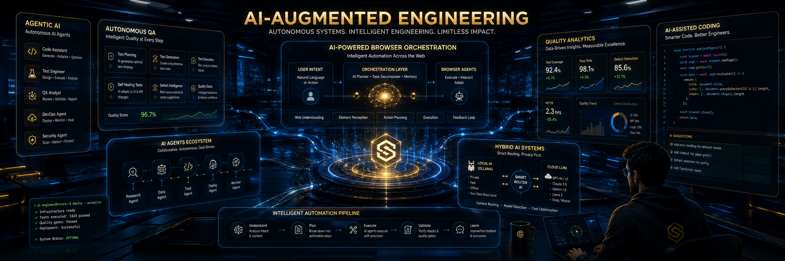

  

# Hi there 👋 I'm Shinoj Narayan

## AI-Augmented Quality Engineering | Agentic AI | Autonomous QA Systems

Building next-generation intelligent quality engineering workflows using AI, automation, and hybrid local/cloud architectures.

---

## 🚀 Current Focus Areas

* Autonomous QA Platforms
* Agentic AI Systems
* Hybrid Local + Cloud AI Workflows
* AI Browser Orchestration
* Intelligent Test Automation
* Multi-Agent Engineering Systems

---

## 🛠 Tech Stack

### AI & LLM

* OpenAI
* Ollama
* CrewAI
* MCP
* LangChain
* RAG Pipelines

### QA & Automation

* Selenium
* Robot Framework
* Python Automation
* API Testing
* Zephyr Integration

### Development

* Python
* JavaScript
* GitHub Actions
* Docker
* REST APIs

---

## 🌟 Featured Projects

### AI Workspace Orchestration

Hybrid AI browser orchestration system integrating local and cloud LLM workflows for intelligent productivity automation.

### QA Copilot

AI-assisted quality engineering platform for intelligent test workflows, defect analysis, and execution insights.

### Autonomous QA Platform

Architecture-first framework for next-generation autonomous quality engineering systems powered by multi-agent AI.

---

## 📝 Medium Articles

* The QA Revolution You’re Not Hearing About
* Agentic AI in Quality Engineering
* AI Browser Evolution
* Hybrid AI Workflow Engineering

---

## 📫 Connect With Me

* LinkedIn: https://www.linkedin.com/in/shinoj-narayan/
* Medium: https://medium.com/@shinulearning
* GitHub: https://github.com/shinulearning

---

## ⚡ Vision

Moving Quality Engineering from:

* Test Automation
  to
* Autonomous Quality Intelligence

* ## AI Research & Innovation

I also maintain ShinuAI Labs — an experimental and educational AI innovation workspace focused on autonomous systems, AI workflows, and agentic engineering research.

https://github.com/shinuailabs
